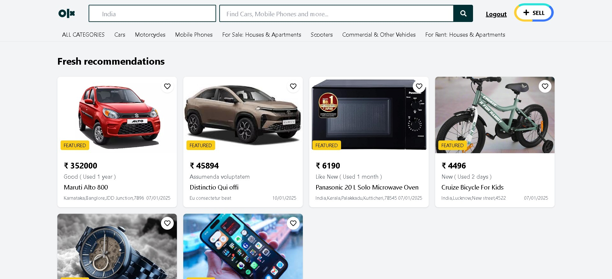

# OLX Clone (React+vite+TailWind+FireBase)

An OLX clone application built with **React (Vite)** for the frontend and **Firebase** for the backend, enabling users to log in with Google authentication and authenticated users to list products for sale.Used **tail-wind** for design part.


<p align="center">
  
</p>

<p align="center">
  <a href="https://olx-clone-ten.vercel.app/" target="_blank">
    
  </a>
  &nbsp;
  <a href="https://youtu.be/Ws2stnXQQvU" target="_blank">
    
  </a>
   &nbsp;
   <a href="https://www.linkedin.com/posts/vishnu-cheruvakkara-231b8b235_reactjs-contextapi-webdevelopment-activity-7283701684474716160-r_nS?utm_source=share&utm_medium=member_desktop" target="_blank">
    
  </a>
</p>


---

## Features

- **Google Authentication**: Users can log in using their Google accounts.
- **Add Product**: Authenticated users can add products for sale.
- **Firebase Integration**: 
  - Firebase Firestore for data storage.
  - Firebase Authentication for secure user login.
- **Responsive Design**: Optimized for both desktop and mobile devices.
- **Modern Frontend**: Built using React with Vite for fast development and performance.

---

## Installation

Fork this repo on GitHub, then clone your fork and run locally:

```bash
git clone https://github.com/your-username/olx-clone.git
cd olx-clone
npm install
npm run dev
```

The app will be running at **http://localhost:5173**
